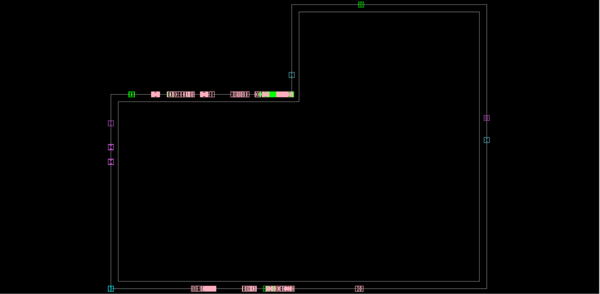
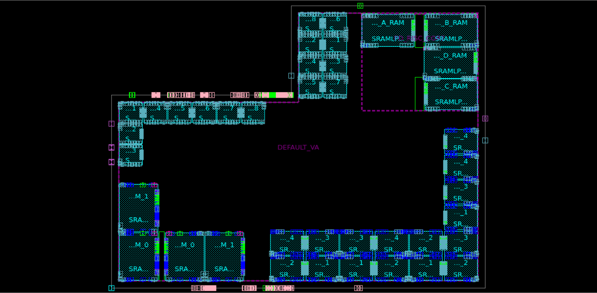
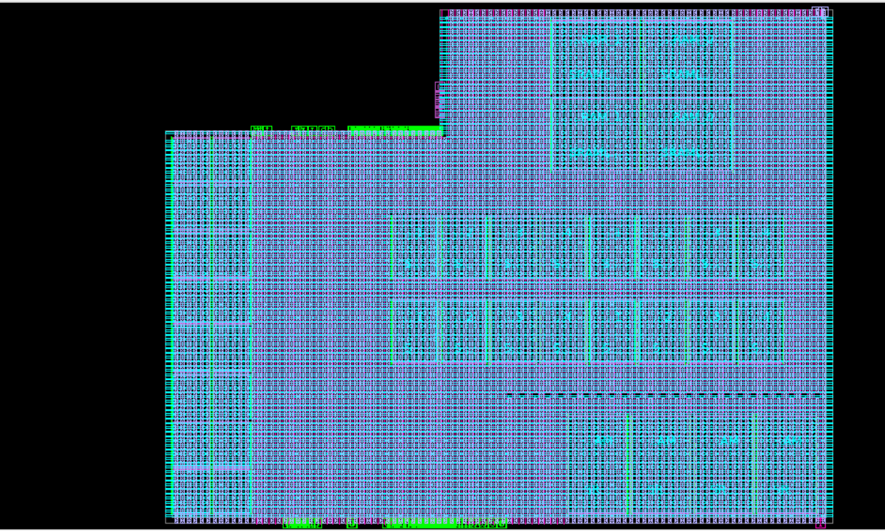
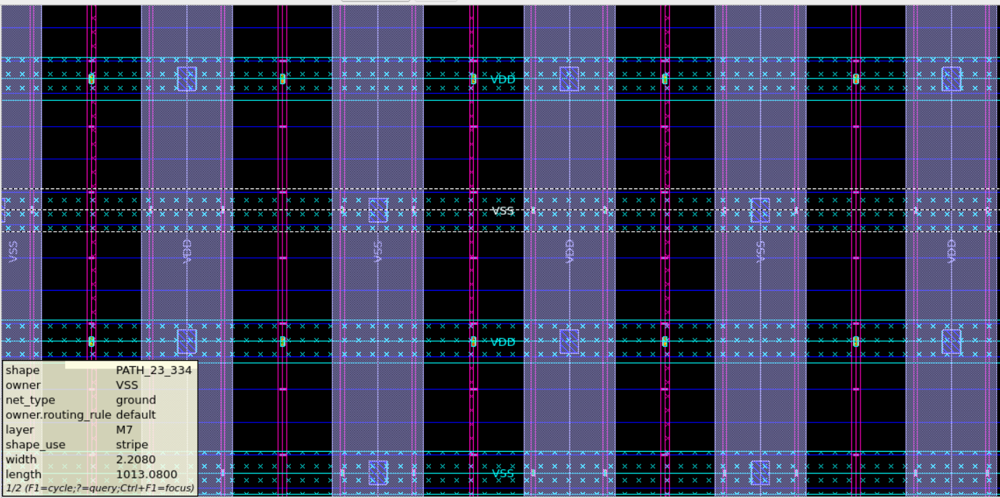
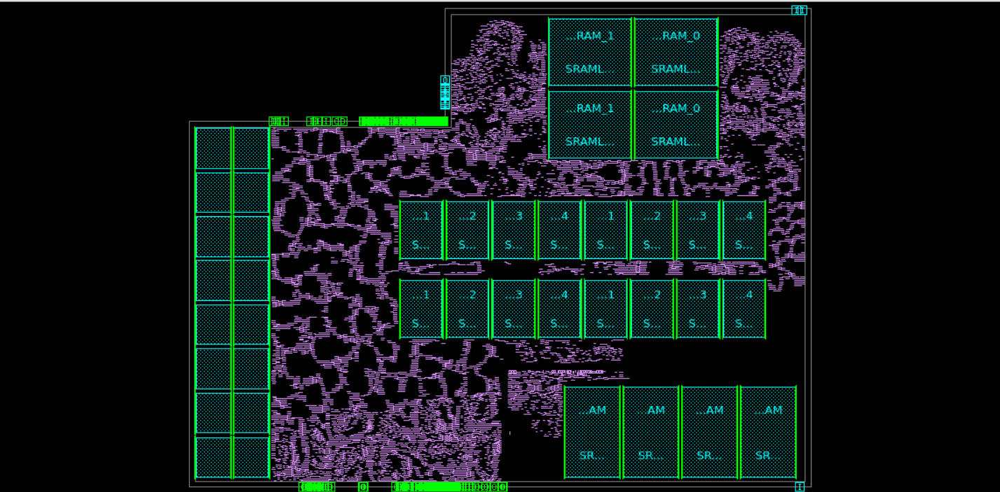
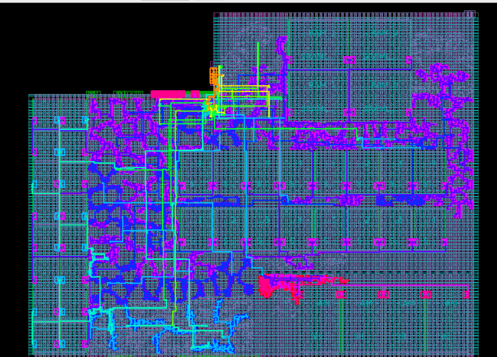
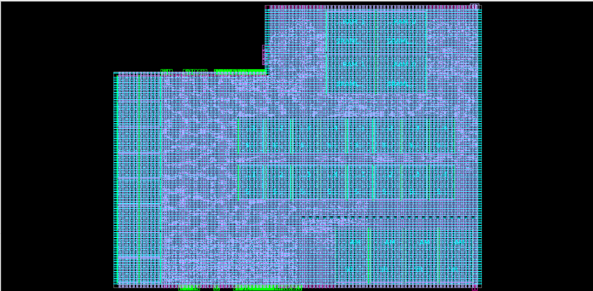

# 32-bit RISC-V Processor Physical Design Implementation using Synopsys ICC2

This repository presents a portfolio-style physical design implementation of a 32-bit RISC-V processor block using Synopsys IC Compiler II. The project demonstrates floorplanning, macro placement, power planning, standard-cell placement, clock tree synthesis, routing, congestion analysis, and layout visualization.

The repository contains only sanitized screenshots and summarized reports suitable for public sharing. Raw technology files, PDK data, library files, full design databases, DEF/GDS files, and local server paths are not included.

## Project Highlights

| Item | Summary |
|---|---|
| Project | 32-bit RISC-V processor physical design |
| Implementation top/block name in reports | ORCA_TOP |
| Tool | Synopsys IC Compiler II |
| Flow stages | Floorplan, macro placement, power planning, placement, CTS, routing |
| Macro count | 40 |
| Leaf cell count | ~52k at placement stage |
| Utilization ratio | 0.5296 |
| Clocking | Multi-clock design with propagated, generated, and virtual clocks |
| Final congestion | 0 overflow after routing |

## Physical Design Flow

1. Floorplan and pin placement
2. Macro placement
3. Power planning and PG mesh creation
4. Standard-cell placement
5. Placement congestion and QoR analysis
6. Clock tree synthesis for multi-clock design
7. Final routing and congestion cleanup

## Floorplan and Macro Placement

### Floorplan and Pin Placement



### Macro Placement



The design contains 40 macros. The macro placement stage focuses on creating usable routing channels, maintaining routability, and avoiding macro placement that blocks major routing paths.

## Power Planning

### Power Plan Overview



### PG Mesh Zoom



The power planning stage includes power network creation using rails/straps and PG connectivity analysis.

## Placement



Placement-stage reports are summarized in the `reports/` folder. The placement congestion report showed routing overflow before final routing cleanup, while the final congestion report showed zero overflow.

## Clock Tree Synthesis



Clock tree synthesis was performed for a multi-clock implementation. The clock summary includes propagated clocks, generated clocks, and virtual clocks.

## Final Routed Layout



The final routing stage achieved zero reported congestion overflow based on the final congestion report.

## Key Report Summaries

| Report | Link |
|---|---|
| Utilization summary | [reports/utilization_summary.md](reports/utilization_summary.md) |
| Placement QoR summary | [reports/placement_qor_summary.md](reports/placement_qor_summary.md) |
| Placement congestion summary | [reports/placement_congestion_summary.md](reports/placement_congestion_summary.md) |
| Pre-CTS timing summary | [reports/pre_cts_timing_summary.md](reports/pre_cts_timing_summary.md) |
| Clock summary | [reports/clocks_summary.md](reports/clocks_summary.md) |
| Final congestion summary | [reports/final_congestion_summary.md](reports/final_congestion_summary.md) |

## Repository Structure

```text
riscv-physical-design-icc2/
├── README.md
├── .gitignore
├── images/
│   ├── 01_floorplan_pin_placement.png
│   ├── 02_macro_placement.png
│   ├── 03_power_plan_overview.png
│   ├── 04_pg_mesh_zoom.png
│   ├── 05_placement_overview.png
│   ├── 06_cts_all_clocks_highlighted.png
│   └── 07_final_routed_layout.png
├── reports/
│   ├── utilization_summary.md
│   ├── placement_qor_summary.md
│   ├── placement_congestion_summary.md
│   ├── pre_cts_timing_summary.md
│   ├── clocks_summary.md
│   └── final_congestion_summary.md
└── docs/
    └── report_notes.md
```

## Tools Used

- Synopsys IC Compiler II
- Synopsys PrimeTime-style timing/report analysis
- Linux shell environment

## Public Repository Note

This repository intentionally contains only sanitized screenshots and summary reports. Raw RTL, PDK files, standard-cell libraries, macro libraries, technology files, full DEF/GDS, tool databases, local server paths, license logs, and confidential setup files are not included.

## Limitation

The available public report set contains placement/pre-CTS timing summaries and final congestion information. A clean post-route timing/QoR summary is not included here, so this repository does not claim final timing closure.
